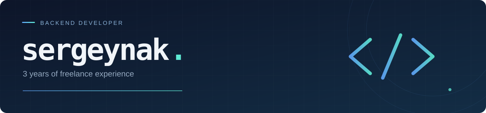

  

<h1 align="center">Sergey Nakonechny</h1>

<strong>Backend Developer &nbsp;·&nbsp; Freelancer</strong>

I’m a backend-focused developer with **3 years of freelance experience**. My stack also includes frontend frameworks and WordPress.

## Tech stack

### Backend

  
  
  
  
  
  

### Frontend

  
  
  

### CMS

  

---

Backend first. Full-stack perspective.

